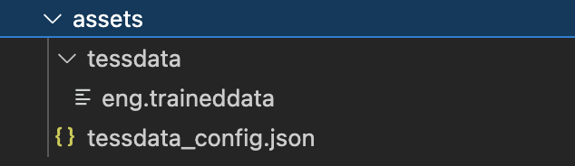
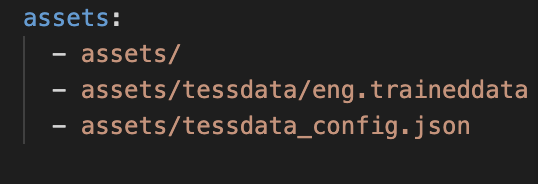

## Overview

A Flutter plugin which helps you to add aadhaar kyc to your app. The package asks you for one required parameters to pass the api key from postman.

## Features

1. Aadhaar Validation
2. Aadhaar OTP Generation 
3. Aadhaar OTP Verification
   
## Getting Started

## 1. Add package to your project

Complete description to add this package to your project can be found [here](https://pub.dev/packages/).

## 2. To setup native performance for the application

## iOS 

This plugin requires iOS 9.0 or higher.

Add the following keys to your Info.plist file, located in <project root>/ios/Runner/Info.plist:

1. NSPhotoLibraryUsageDescription - describe why your app needs permission for the photo library. This is called Privacy - Photo Library Usage Description in the visual editor.

This permission is not required for image picking on iOS 11+ if you pass false for requestFullMetadata.

2. NSCameraUsageDescription - describe why your app needs access to the camera. This is called Privacy - Camera Usage Description in the visual editor.

3. NSMicrophoneUsageDescription - describe why your app needs access to the microphone, if you intend to record videos. This is called Privacy - Microphone Usage Description in the visual editor.

## Android 

Starting with version 0.8.1 the Android implementation support to pick (multiple) images on Android 4.3 or higher.

1. No configuration required - the plugin should work out of the box. It is however highly recommended to prepare for Android killing the application when low on memory. How to prepare for this is discussed in the Handling MainActivity destruction on Android section.

2. It is no longer required to add android:requestLegacyExternalStorage="true" as an attribute to the <application> tag in AndroidManifest.xml, as image_picker has been updated to make use of scoped storage.

### Note: 
Images and videos picked using the camera are saved to your application's local cache, and should therefore be expected to only be around temporarily. If you require your picked image to be stored permanently, it is your responsibility to move it to a more permanent location.

## For enabling Tesseract OCR support

  Download and add tessaract data folder to your project assets and configure it in your pubspec.yaml

  Step 1: Download trained data file from [eng.traineddata](https://github.com/tesseract-ocr/tessdata/blob/main/eng.traineddata)

  Step 2: Add it to your assets folder assets>tessdata>eng.traineddata

  Step 3: Create tessdata_config.json file inside on root of your asset folder

  Step 4: Add following code to your tessdata_config.json

  ```json
  {
    "files": [
      "eng.traineddata"
    ]
}
  ``` 
 

## Aadhaar KYC API

In this package we have used [Postman Aadhaar_KYC API](https://www.postman.com/annaieservice/workspace/annai/documentation/13120387-5a89269c-0972-40dd-b14a-ace5ce4afe93?entity=folder-c9c9abf3-968e-4cb8-8680-883dafec579e) Service based on usage you can go with trial or paid version of same. We have used following services from the api.

### [Generate OTP](https://www.postman.com/annaieservice/workspace/annai/documentation/13120387-5a89269c-0972-40dd-b14a-ace5ce4afe93?entity=request-0cf26827-b1c1-45b8-a233-0ca7ebfaff2f)
This API is used for generating OTP to registered number on aadhaar.

### [Submit OTP](https://www.postman.com/annaieservice/workspace/annai/documentation/13120387-5a89269c-0972-40dd-b14a-ace5ce4afe93?entity=request-03b1a961-84e3-4ba9-96e5-b94e90d6f71e)
This API is used for verfying OTP recieved on registered number of aadhaar.

## Implementation

  ```dart
      // Adding AadhaarKYC feature as widget to your    application.
      AadhaarKyc(
        apiKey:
            "Your API Key",
      ),
  ``` 

### Properties to customize on aadhaar_kyc

| Properties                   | Description     
| ---------------------------- |-------------|
| apiKey                       | To pass your postman api key 
| containerWidth               | To set display width of AadhaarKyc widget |
| containerHeight              | To set display height of AadhaarKyc widget |
| containerPadding             | To set display padding of AadhaarKyc widget |
| containerBackground          | To set background color of the AadhaarKyc widget |
| textFormFieldPadding         | To set padding of text form field of the AadhaarKyc widget |
| aadhaarNumberHintText        | To set display height of AadhaarKyc widget |
| otpTextFieldColor            | To set display height of AadhaarKyc widget |
|

## Example
Please run the app in the [example folder](https://github.com/GeekyAnts/aadhaar_kyc_flutter/tree/master/example) to get clear idea of implementation !

## Code Illustration

  ```dart
import 'package:aadhaar_kyc_flutter/aadhaar_kyc_flutter.dart';
import 'package:flutter/material.dart';

void main() {
  runApp(const MyApp());
}

class MyApp extends StatelessWidget {
  const MyApp({Key? key}) : super(key: key);

  // This widget is the root of your application.
  @override
  Widget build(BuildContext context) {
    return const MaterialApp(
      title: 'Adhaar Kyc Demo',
      home: MyHomePage(),
    );
  }
}

class MyHomePage extends StatefulWidget {
  const MyHomePage({super.key});

  @override
  State<MyHomePage> createState() => _MyHomePageState();
}

class _MyHomePageState extends State<MyHomePage> {
  @override
  Widget build(BuildContext context) {
    return Scaffold(
      appBar: AppBar(
        backgroundColor: const Color.fromARGB(255, 3, 44, 77),
        title: const Text('Aadhaar Kyc'),
        centerTitle: false,
      ),
      body: const 
      // AadhaarKyc Widget 
      AadhaarKyc(
        apiKey: "Your API Key",
      ),
    );
  }
}
  ``` 